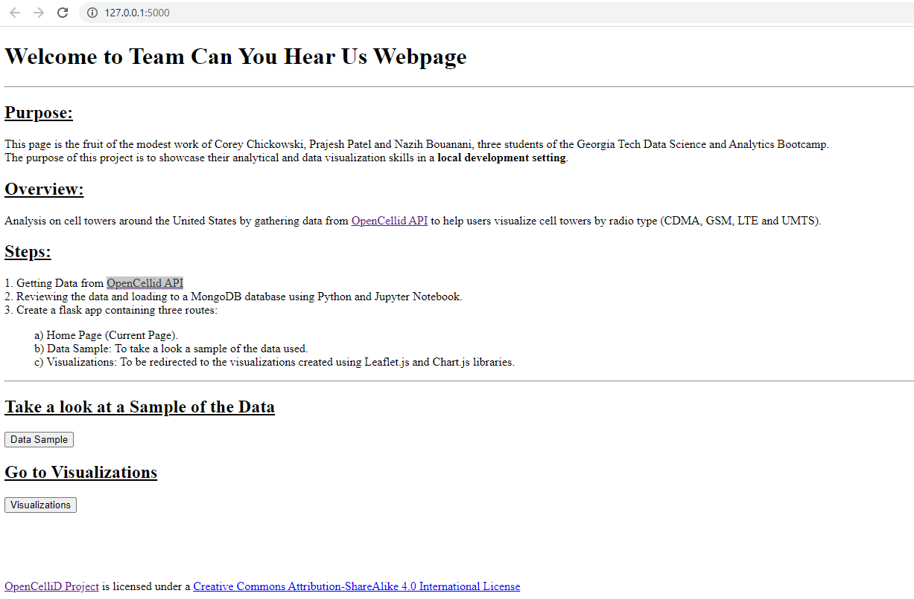

# Project3_Cell_Towers_Analysis: Team Can You Hear Us!

## Purpose:

This page is the fruit of the modest work of Corey Chickowski, Prajesh Patel and Nazih Bouanani, three students of the Georgia Tech Data Science and Analytics Bootcamp.

The purpose of this project is to showcase their analytical and data visualization skills in a local development setting.

## Overview:

Analysis on cell towers around the United States by gathering data from [OpenCellid API](https://opencellid.org/) to help users visualize cell towers by radio type (CDMA, GSM, LTE and UMTS).

## Steps:
1. Getting Data from [OpenCellid API](https://opencellid.org/).
2. Reviewing the data and loading to a MongoDB database using Python and [Jupyter Notebook](Data.ipynb).
3. Create a [flask app](app.py) containing three routes:

a) Home Page (Current Page).

b) Data Sample: To take a look a sample of the data used.

c) Visualizations: To be redirected to the visualizations created using [Leaflet.js](static/js/logic.js) and [Chart.js](static/js/plots.js) libraries.

## Project Challenges:

There were over 6 million records for the United States based on the OpenCellID data available. Because we use the Flask application locally on our devices, we were forced to use smaller samples than the whole database to maintain peak performance of our visualizations.

[OpenCellid API](https://opencellid.org/) is licensed under a (Creative Commons Attribution-ShareAlike 4.0 International License)[https://creativecommons.org/licenses/by-sa/4.0/]